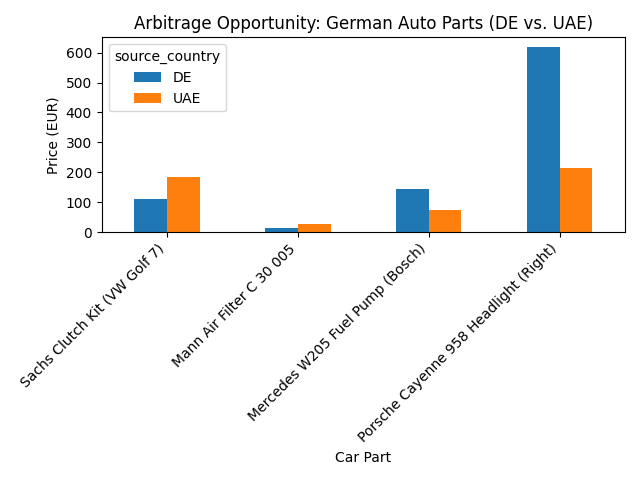

# 🚗 Automotive Arbitrage Analysis (DACH vs. GCC)

## 📊 Executive Summary
This project analyzes price disparities for automotive spare parts between the **German (DACH)** and **Dubai (GCC)** markets. By leveraging algorithmic price tracking, we identify high-margin arbitrage opportunities for:
1.  **Export:** Sourcing parts in Germany to sell in Dubai.
2.  **Reverse Logistics:** Sourcing overstock in Dubai to sell back to Europe.

## 📈 Key Findings (Live Data)
Analysis of the current basket reveals significant arbitrage gaps in **Brake Systems** and **Clutch Kits**.

## 🛠️ Technology Stack
* **Python:** Data processing and logic.
* **SQLite:** Relational database for inventory tracking.
* **Pandas/Matplotlib:** Financial modeling and visualization.

---
*Project maintained by Imran Ismail*